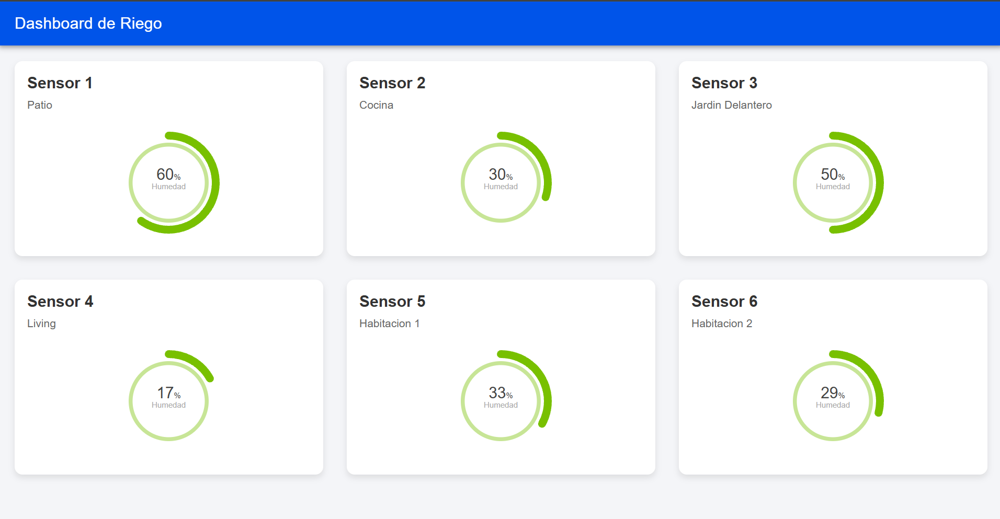
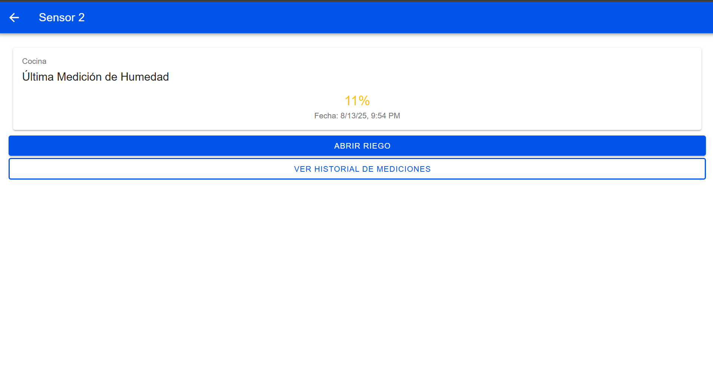
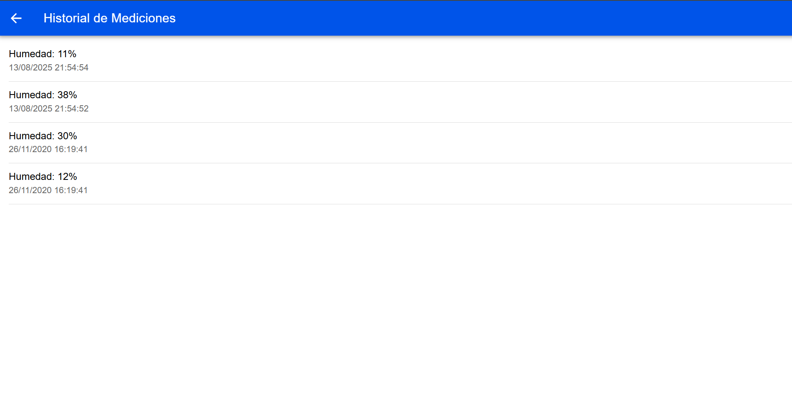

# Aplicación de Riego IoT - DAM-RM-2025

Este proyecto consiste en una aplicación full-stack para el monitoreo y control de sensores de riego. La aplicación está desarrollada con un frontend en **Ionic/Angular**, un backend en **Node.js/Express**, y una base de datos **MySQL**, todo orquestado y desplegado en contenedores usando **Docker**.

## Comenzando

Esta sección es una guía con los pasos esenciales para poner en marcha la aplicación completa.

### Requisitos Previos

Para correr este proyecto, el único requisito es tener instalado **Docker Desktop** en tu sistema operativo (Windows, macOS o Linux).

### Ejecución de la Aplicación

1.  Clona este repositorio en tu computadora.
2.  Abre una terminal en la carpeta raíz del proyecto (`DAM-RM-2025`).
3.  Ejecuta el siguiente comando. Este comando construirá las imágenes de Docker necesarias y pondrá en funcionamiento todos los servicios.

    ```bash
    docker-compose up --build -d
    ```
4.  La primera vez, la construcción del frontend puede tardar varios minutos. Una vez que el proceso termine, podrás acceder a los siguientes servicios desde tu navegador:

    * **Frontend (Dashboard de Riego)**: [http://localhost:8100](http://localhost:8100)
    * **Administrador de Base de Datos (phpMyAdmin)**: [http://localhost:8080](http://localhost:8080)
    * **API Backend (Endpoint de prueba)**: [http://localhost:3000/api/dispositivos](http://localhost:3000/api/dispositivos)

Para detener todos los servicios, ejecuta el comando `docker-compose down` en la misma terminal.

### Nota Importante sobre la Memoria

El proceso de compilación del frontend (Ionic/Angular) consume una cantidad considerable de memoria RAM. Si la aplicación no carga o el contenedor del frontend se reinicia constantemente (uso de CPU al 100%), es muy probable que Docker no tenga suficientes recursos asignados.

* **Solución**: Aumenta la memoria asignada a Docker. En Windows, esto se hace creando un archivo `.wslconfig` en tu carpeta de usuario. Se recomienda asignar al menos **4GB** de memoria.

## Implementación y Funcionalidades

A continuación, se describe el funcionamiento del sistema.

### Página Principal (Dashboard)

La página principal (`/home`) muestra un dashboard con todos los sensores disponibles. Cada sensor se representa como una tarjeta que incluye:
* Nombre y ubicación del sensor.
* Un medidor circular que muestra en tiempo real el porcentaje de la última medición de humedad.



### Página de Detalle del Dispositivo

Al hacer clic sobre una tarjeta del dashboard, se navega a la página de detalle del sensor. Esta vista muestra:
* La última lectura de humedad con su fecha y hora.
* Dos botones de acción principales:
    * **Abrir/Cerrar Riego**: Permite accionar la electroválvula. Al hacerlo, se registra un nuevo log de riego y una nueva medición de humedad simulada.
    * **Ver Historial de Mediciones**: Navega a una vista con todos los registros históricos del sensor.



### Listado de Mediciones

Esta página muestra un listado completo de todas las mediciones registradas para el sensor seleccionado, ordenadas de la más reciente a la más antigua.



### Servicios y Endpoints de la API

El `ApiService` en el frontend centraliza todas las peticiones al backend. Los endpoints disponibles son:

| **Método** | **Endpoint** | **Descripción** |
| :--- | :--- | :--- |
| `GET`      | `/api/dispositivos`                   | Obtiene un listado de todos los dispositivos.                                    |
| `GET`      | `/api/dispositivos/:id`               | Recupera los datos de un dispositivo específico y su última medición.            |
| `GET`      | `/api/dispositivos/:id/mediciones`    | Obtiene el historial completo de mediciones para un dispositivo.                 |
| `POST`     | `/api/electrovalvulas/:id/accionar`   | Registra una acción de riego (apertura/cierre) y una nueva medición de humedad.  |
